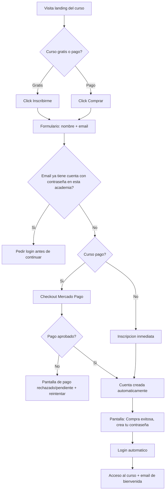

# Cursonube — UX Flows
### Documento 4 de 16 · Estado: 🟡 En revisión — pendiente de aprobación

---

## 1. Alcance

Este documento describe los flujos de extremo a extremo para las tres audiencias definidas en el Product Book: **Creador** (Owner/Administrador/Profesor/Editor), **Alumno**, y **Staff de Cursonube**. No incluye wireframes pixel-level (eso es diseño visual, fuera del alcance de un documento de texto) — describe pantallas, estados, validaciones y casos borde con el nivel de detalle que un equipo de desarrollo necesita para no tener que inventar el comportamiento.

Principio rector heredado del Product Book: **nunca debe existir una pantalla vacía sin contexto ni salida.** Todo estado "sin datos todavía" lleva un mensaje claro y una acción concreta.

## 2. Flujo 1 — Registro y Wizard de Onboarding (Creador)

| Paso | Pantalla | Detalle |
|---|---|---|
| 0 | Registro de cuenta | Email + contraseña del futuro Owner. Aceptación de términos. Esto crea el `AcademiaUsuario` con rol Owner, aún sin `Academia` asociada. |
| 1 | Nombre de la academia | Campo simple. Se propone un subdominio sugerido a partir del nombre (editable en el paso 2). |
| 2 | Subdominio | Validación en tiempo real (debounced) contra unicidad global. Reglas: minúsculas, sin espacios, solo `[a-z0-9-]`, y una lista de palabras reservadas bloqueadas (`www`, `admin`, `app`, `api`, `mail`, `cursonube`, etc.) para evitar colisiones con infraestructura propia. |
| 3 | Plantilla | Selección visual entre las 5 plantillas (Creator, Academy, Business, Modern, Dark) con preview. |
| 4 | Branding | Logo, color primario, color secundario, imagen principal. **Todos opcionales** — "Omitir y usar valores por defecto" siempre visible, porque la plantilla ya se ve terminada sin personalizar nada (principio de cero pantalla vacía). |
| 5 | Primer curso (opcional) | Título + descripción mínima. Si se omite, el dashboard muestra un estado vacío con ilustración + botón "Creá tu primer curso" — nunca una tabla en blanco sin explicación. |

**Al finalizar:** redirección a `subdominio.cursonube.com` (ya funcional y navegable) + dashboard del creador con un checklist de activación ("Agregá tu primer curso", "Conectá tu Mercado Pago", "Invitá a tu equipo").

**Casos borde:**
- Abandono a mitad del wizard: el progreso se guarda: al volver a entrar, retoma en el paso siguiente al último completado.
- Botón atrás / refresh: no pierde datos ya ingresados.
- Subdominio ocupado: mensaje inmediato + sugerencias alternativas (ej. agregar sufijo numérico).

## 3. Flujo 2 — Creación de contenido: curso → módulo → clase (Creador)

1. Dashboard → Cursos → "Nuevo curso".
2. Formulario: título, descripción, tipo de acceso (gratis / pago único), precio si aplica, imagen de portada. Se crea en estado `borrador`.
3. Dentro del curso: agregar módulos (título, orden) y, dentro de cada módulo, agregar clases.
4. Cada clase: pegar link de YouTube No Listado (con validación de formato), contenido de texto opcional, adjuntos (PDF/archivo/link).
5. Preview de la landing autogenerada del curso (`/cursos/slug`) — el creador la ve, no la edita bloque por bloque (decisión ya tomada en el Modelo de Datos).
6. Botón "Publicar curso" pasa el curso de `borrador` a `publicado`, recién ahí aparece en el sitio público y es comprable.

## 4. Flujo 3 — Edición de landing con editor de bloques (Creador)

1. Panel → Sitio → selecciona una página (Inicio, Sobre Nosotros, o una página custom creada por el usuario).
2. Ve la lista de bloques en orden, con controles por bloque: mover arriba/abajo (o drag), duplicar, eliminar.
3. Click en un bloque abre un panel lateral de propiedades editables según su tipo (Hero: título/subtítulo/imagen/CTA; Testimonios: lista de testimonios; etc.).
4. Los cambios se guardan automáticamente como borrador (autosave) — no hay botón "Guardar" que el usuario deba recordar apretar.
5. Botón explícito **"Publicar cambios"** aplica el borrador como versión pública. Esto separa "estoy probando cosas" de "esto ya lo ve mi audiencia", evitando que un cambio a medio hacer quede visible en producción.

## 5. Flujo 4 — Invitar Profesor/Editor (Owner/Administrador)

1. Panel → Equipo → "Invitar".
2. Formulario: email + rol (Administrador / Profesor / Editor — la matriz exacta de permisos se define en el Documento 7).
3. **Antes de enviar la invitación**, el sistema chequea el límite de `max_profesores_editores` del plan contratado (Entitlements). Si ya está en el límite: se bloquea con un mensaje claro y un CTA "Actualizá tu plan para invitar a más personas" — nunca un error genérico.
4. El invitado recibe un email con un link de activación, define su contraseña, y entra con los permisos de su rol.

## 6. Flujo 5 — Descubrimiento y compra (Alumno, incluye guest checkout)

**Por qué el caso "email ya existe con contraseña" exige login (no se asume):** permitir adjuntar una compra a una cuenta existente sin autenticar sería, en los hechos, dejar que cualquiera "compre" a nombre del email de otra persona y quede con acceso implícito a esa cuenta. Es el único punto de este flujo que no es una decisión de negocio sino un requisito de seguridad no negociable.

No existe carrito de compra — es una decisión deliberada de simplicidad: cada curso se compra individualmente con su propio checkout, consistente con "no queremos funcionalidades innecesarias" del Product Book. Si en el futuro se detecta necesidad real de compra combinada, se evalúa como feature nueva, no se asume ahora.

## 7. Flujo 6 — Login recurrente (Alumno)

`academia.cursonube.com/login` → email + contraseña → "Olvidé mi contraseña" dispara reset por email → acceso al Panel del Alumno.

## 8. Flujo 7 — Experiencia de aprendizaje (Alumno)

1. Panel del alumno → "Mis cursos" → entra a un curso.
2. Sidebar con módulos/clases y su estado (completada / pendiente).
3. Reproduce la clase (embed de YouTube No Listado). La clase se marca completada automáticamente al llegar al final del video (evento `ended` del player), con un botón manual "Marcar como completada" como respaldo (por si el autodetect falla o el alumno ya vio el contenido en otro lado).
4. Al completar el 100% de las clases del curso: se dispara `CourseCompletedEvent` → el módulo de Certificados genera el PDF automáticamente → pantalla "¡Curso completado!" con botón de descarga.

## 9. Flujo 8 — Panel del Alumno

Vista principal: lista de cursos inscriptos con barra de progreso, acceso directo a "continuar donde lo dejaste" (última clase vista), y certificados obtenidos descargables.

## 10. Flujo 9 — Panel de Administración interno (Staff de Cursonube)

1. Login de staff (separado del login de academias/alumnos — tabla `CursonubeStaff`).
2. Listado de academias, con búsqueda y filtro por estado (activa/suspendida/cancelada).
3. Detalle de una academia: plan actual, estado de suscripción, cantidad de alumnos, historial de facturación.
4. Acciones: suspender/reactivar, cambiar de plan manualmente (para casos de soporte), ver `AuditLog` de acciones previas sobre ese tenant.
5. Estadísticas globales: cantidad de tenants activos, MRR total, altas del mes.

## 11. Flujo 10 — Plan y facturación de la academia con Cursonube (Owner)

Panel → Configuración → "Plan y facturación": plan actual y sus límites, botón de upgrade/downgrade, historial de facturas de la suscripción a Cursonube (vía Mercado Pago Suscripciones), método de pago.

## 12. Estados transversales (cross-cutting)

- **Plan-limit alcanzado:** siempre un bloqueo con mensaje explicativo + CTA de upgrade, nunca un error genérico ni un botón que simplemente no responde.
- **Cero pantalla vacía:** todo listado sin datos (cursos, alumnos, páginas) muestra una ilustración/mensaje + acción concreta para generar el primer dato.
- **Suspensión de academia por impago a Cursonube:** ver decisión pendiente en la sección 14.
- **Downgrade de plan por debajo de uso actual** (ej. una academia con 5 profesores baja a un plan que permite 2): ver decisión pendiente en la sección 14.

## 13. Qué no se modela en este documento

- Wireframes visuales pixel-level — corresponde a diseño UI, no a este documento de flujos.
- Flujos de clases en vivo, comunidad, chat, foros, afiliados — fuera de V1 (Product Book).
- Flujo de compra de suscripciones/membresías del creador a sus alumnos — V1.1 (Product Book, F3).

## 14. Decisiones irreversibles o costosas de revertir

Estas dos decisiones son técnicamente reversibles en el código, pero tienen un costo de **confianza con el cliente** difícil de revertir una vez comunicado — por eso se tratan con el mismo rigor que una decisión de arquitectura.

| # | Decisión | Por qué es costosa de revertir | Estado |
|---|---|---|---|
| U1 | **Impago:** tras un período de gracia, se bloquea únicamente el panel de gestión (Owner/Admin/Profesor/Editor). El sitio público y el acceso de alumnos ya inscriptos a sus cursos y certificados **sigue funcionando** — el problema de facturación es entre la academia y Cursonube, no responsabilidad del alumno que ya le pagó al creador. | Comunicar una política y luego endurecerla (o al revés, aflojarla) genera desconfianza real con clientes que ya la conocen. | ✅ Confirmado. |
| U2 | **Downgrade con exceso:** se permite el cambio de plan igual, los recursos existentes (ej. profesores ya activos) no se tocan, pero se bloquean altas nuevas hasta que el uso real vuelva a estar dentro del nuevo límite. | Desactivar automáticamente algo que ya estaba funcionando rompe operación real sin aviso; la política elegida se vuelve una expectativa comunicada al cliente. | ✅ Confirmado. Mismo patrón que Slack/Shopify. |

---
**Documento 4 (UX Flows) — sin puntos pendientes.** Si confirmás, lo marco ✅ Aprobado en `docs/README.md` y avanzamos al Documento 5 (Diseño del Editor por Bloques).
